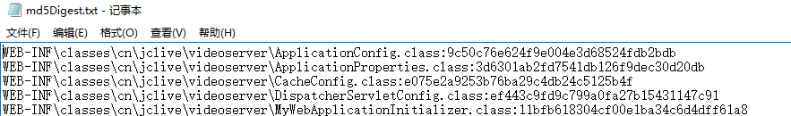
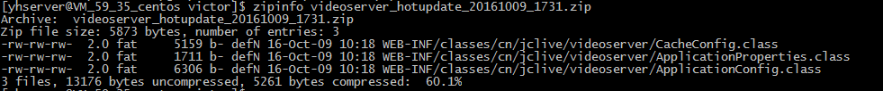

## 问题
1. 明明只改了一个文件，却要更新几十兆的包，浪费时间和带宽
2. 更新整个项目有风险，因为不能保证其他的提交是没有问题的

## 热更工具要解决
1. 更新时只更新我刚刚修改过的内容，不包含其他无变动部分
2. 记录版本更新内容
3. 针对java的war包的具体情况

## 使用
1. 安装python
2. 修改配置
3. 运行python hotupdate.py

## 效果
### 文件的md5快照数据

### 产生的热更包文件

### 热更包内的文件内容

